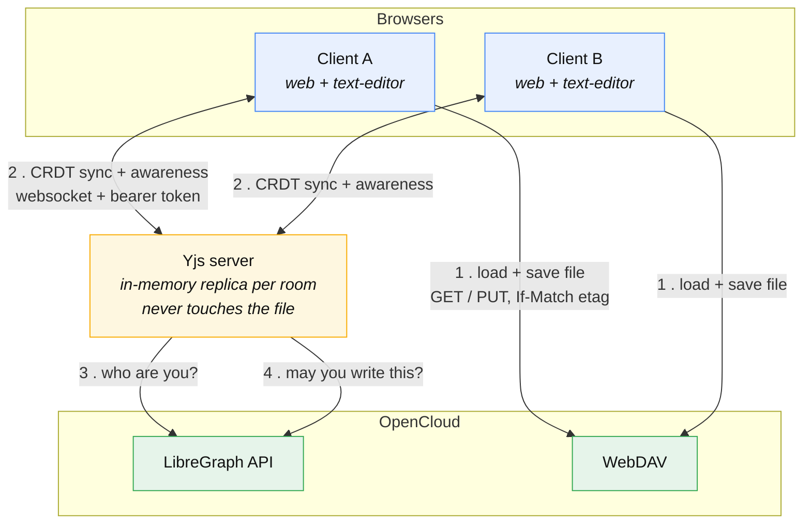
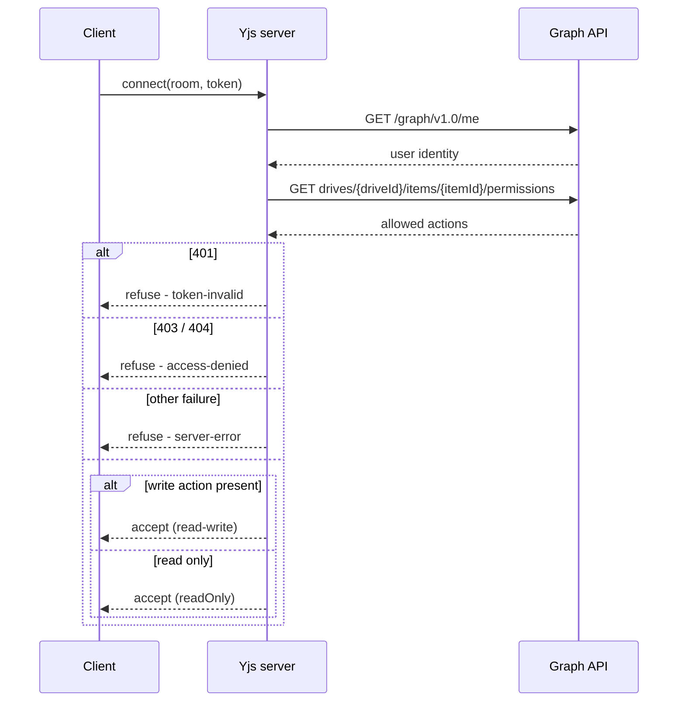
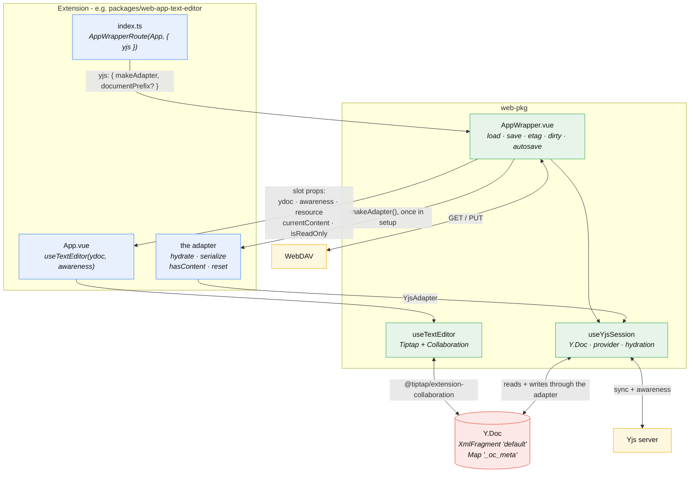
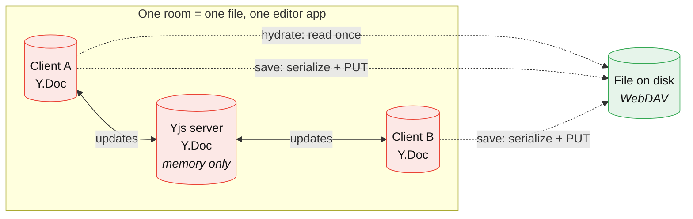
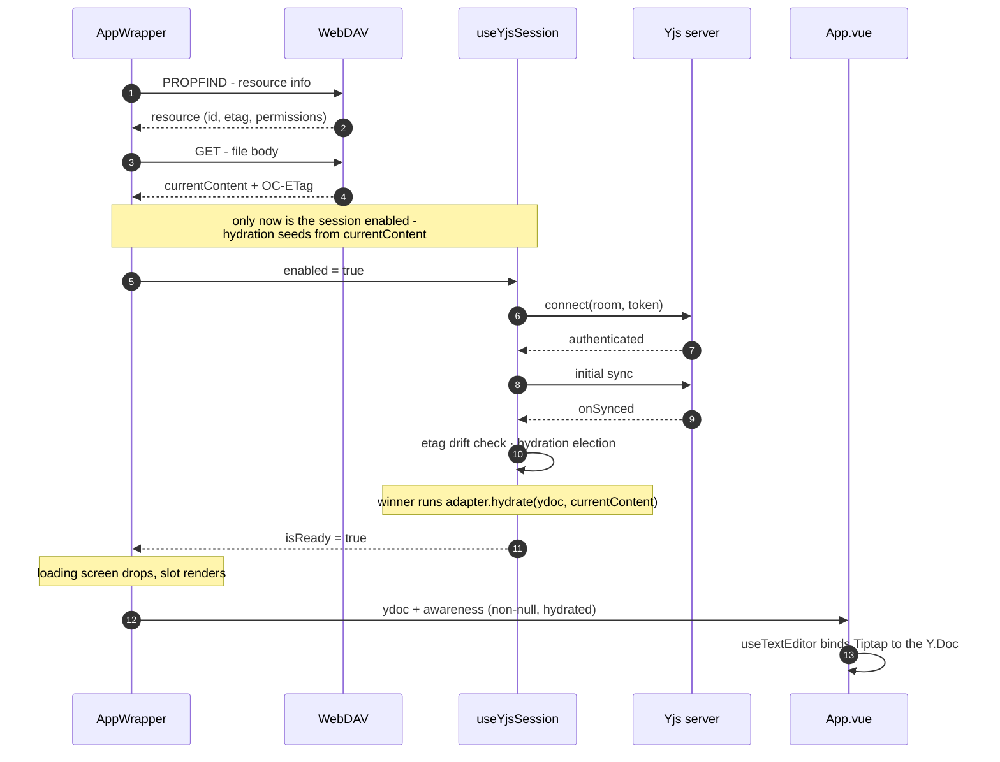
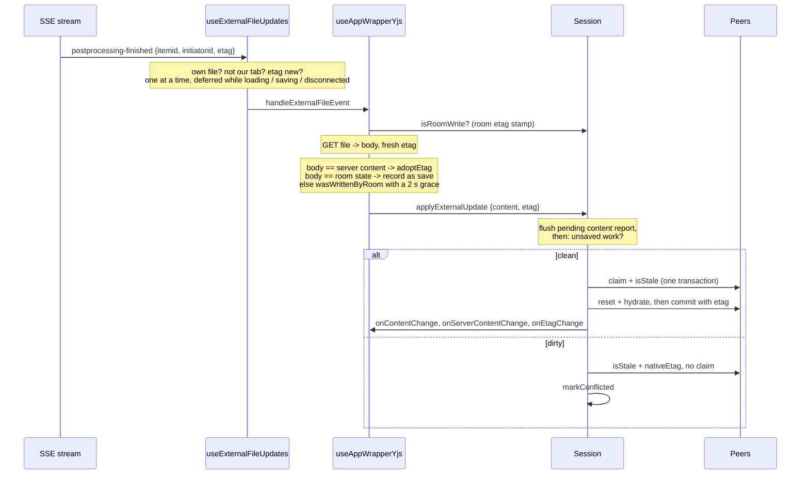
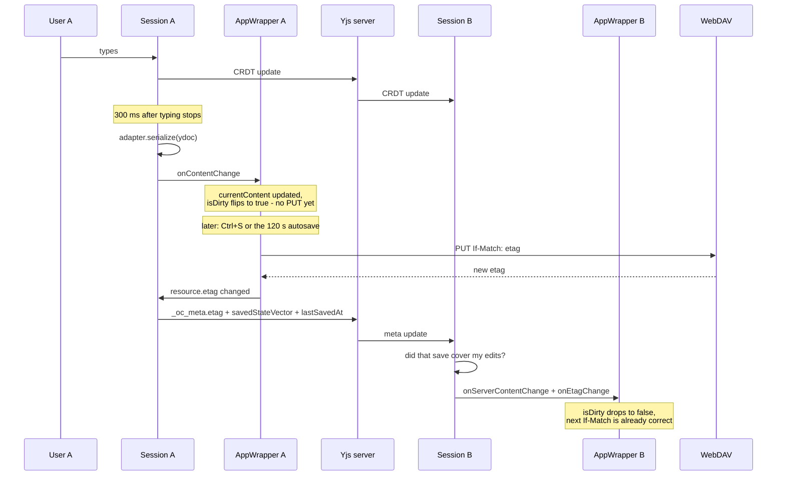

# Yjs

This doc explains the architecture and implementation of collaborative editing in OpenCloud Web. It is intended for
developers who want to understand how it works, or who want to implement their own collaborative app on top of the same
infrastructure.

It is all built on [Yjs](https://yjs.dev/), a CRDT framework for building collaborative applications. Yjs provides the
data structures and algorithms for merging concurrent edits from multiple clients, ensuring that all clients eventually
converge to the same state. `yjs` is the term used throughout the code for everything belonging to it, most of all the
external server.

## System view



### The Yjs server

The [OpenCloud Yjs server](https://github.com/opencloud-eu/web/tree/main/services/yjs) runs
a [Hocuspocus](https://tiptap.dev/docs/hocuspocus) server that relays Yjs updates between clients editing the same file.

It is reachable at whatever URL the deployment configures. In the Web dev setup that is `/yjs` on the OpenCloud host,
forwarded by OC's own proxy, but it could equally be a separate domain behind its own ingress. The server URL needs to
be defined via the `WEB_OPTION_YJS_SERVER_URL` environment variable.

| It does                                              | It does not                                      |
| ---------------------------------------------------- | ------------------------------------------------ |
| Hold an in-memory replica and sync it with peers     | Persist anything (no storage extension is wired) |
| Authenticate the bearer token against Graph `/me`    | Read or write the file                           |
| Enforce read/write access per file, per user         | Decide when to save                              |
| Stamp the authenticated identity onto awareness      | Serialize the CRDT back to text                  |
| Relay versioned room names without interpreting them | Survive a restart, or an empty room              |

Notably it never converts the CRDT back into file content. That only happens in a browser, through the app's adapter -
which is why saving needs a client to be online.

### Access control

`onAuthenticate` runs per connection, before any document data flows:



The room name is `<prefix>::<storageid>$<spaceid>!<opaqueid>:<webVersion>`. The prefix is `yjs.documentPrefix`,
defaulting to the app's `applicationId`. The file id is `resource.fileId ?? resource.id`, which is the real composite id
for everyone: plain WebDAV resources set `fileId` to `id`, and the recipient of a share gets it from `remoteItem.id`.
Neither of the other two candidates works. `resource.remoteItemId` is the _share space_ id, so every file inside a
shared folder would collapse into one room. `resource.id` alone breaks the recipient of a _directly_ shared file, where
the resource is the share root and `id` is that recipient's private share-jail mount point - each recipient would get
their own room, so live edits would not merge and saves would collide as ordinary WebDAV conflicts.

`webVersion` comes from `process.env.PACKAGE_VERSION` (fallback `0.0.0`). Room membership is versioned by name: equal
versions share one room, different versions do not. `_oc_meta` is not used for version negotiation. The server strips
both `<prefix>::` and the optional `:<webVersion>` suffix before parsing, so the ACL probe always targets the real file
id. The prefix still exists so two editors with incompatible Y.Doc layouts (Tiptap's
`Y.XmlFragment` vs CodeMirror's `Y.Text`) never share a room for the same file.

Awareness is anti-spoofed: `beforeHandleAwareness` overwrites the `user` field on every inbound awareness state with the
identity from the authenticated connection, so a client cannot present itself as someone else. Yjs never echoes a
client's own awareness back, so the `connected` hook sends each client its stamped identity over a stateless message.
The client puts it into its own `user` awareness field, which is how it shows up in the collaborator list next to its
peers.

## Inside `web`

Ownership in one line: **`AppWrapper` owns the file and the session; the app owns the editor and the format.**



### Opting in

An app turns on collaboration with one route option.

```ts
// packages/web-app-text-editor/src/index.ts
AppWrapperRoute(TextEditor, {
  applicationId: 'text-editor',
  yjs: {
    makeAdapter: makeTextEditorAdapter
  }
})
```

### What happens when you open a file

1. WebDAV loads the file → gets saved to `currentContent` (`AppWrapper`)
2. Session creates the Y.Doc (empty, and it exists from here on) (`useYjsSession`, invoked by `AppWrapper`)
3. `HocuspocusProvider` gets handed the Y.Doc and connects to the Yjs server and syncs (`useYjsSession`)

From there on, first client:

1. `hasContent(ydoc)` is `false` → this client wins the election → `adapter.hydrate` (`yjsAdapter.ts`)
2. `deserialize` (md/html pass through, json `JSON.parse`, plain-text builds the ProseMirror JSON itself) (
   `yjsAdapter.ts`)
3. Headless editor is constructed with the strategy's extensions + Collaboration bound to the existing Y.Doc -
   `ySyncPlugin` attaches here (`yjsAdapter.ts`)
4. `setContent` builds the ProseMirror tree, guided by `contentType` and the schema (`yjsAdapter.ts`)
5. `ySyncPlugin` sees that transaction and writes the tree into the Y.XmlFragment
6. Y.Doc lives locally, and syncs to the Yjs server if a provider exists

Both lists run _after_ the etag drift check, which can short-circuit into stale recovery before hydration is ever
considered.

Client joining afterwards:

1. `hasContent(ydoc)` is `true` → return early, no hydration, no election, no 150 ms wait. (`useYjsSession.ts`)
2. Y.Doc lives locally, and syncs to the Yjs server if a provider exists

### Y.Doc

Y.Doc is the CRDT that holds the shared state. It is a tree of shared types, and the editor content lives in a
`Y.XmlFragment` named `"default"`. The session also maintains a `Y.Map` named `"_oc_meta"` for coordination and
metadata.

There is no single global document. Every participant holds its own `Y.Doc`, and the server holds one too:



All three are convergent replicas of the same CRDT. None is authoritative - that is the point of a CRDT: updates applied
in any order end up at the same state. The server's copy is not a coordinator, it is a participant that happens to
always be present.

It exists for two reasons. It gives a late joiner the room's current state in one initial sync, without any peer having
to notice and re-send. And because it is a real `Y.Doc`, server-side hooks could read `_oc_meta` if a future stale probe
ever needed to run server-side. Nothing does today.

The server's replica is memory-only - no storage extension is wired up. When the last client disconnects, the room
empties and that copy is gone. Reconnecting later starts from a blank server doc, which is why hydration runs again.
That is a deliberate trade - see [Known limits](#known-limits).

### The YjsAdapter

The app provides a `YjsAdapter` to the session, which is how the session reads and writes the Y.Doc. The adapter is
responsible for converting between the native file format and the Y.Doc's shared types.

```ts
interface YjsAdapter {
  hydrate(ydoc: Y.Doc, content: string): void | Promise<void>

  serialize(ydoc: Y.Doc): string | Promise<string>

  hasContent(ydoc: Y.Doc): boolean

  reset?(ydoc: Y.Doc): void
}
```

`makeAdapter` runs during `AppWrapper`'s setup - before the file is loaded - so it receives a reactive context (
`{ resource: Ref<Resource> }`) and reads it lazily. It must run in setup because content strategies call `useGettext()`,
which is why `makeTextEditorAdapter` resolves its strategies eagerly and only picks between them per call.

### Startup order



`AppWrapper` keeps its loading screen up until the session reports ready, so `App.vue` mounts against a Y.Doc that is
already synced and hydrated. That is what lets the app declare `ydoc` and `awareness` as required props and call
`useTextEditor` directly, with no placeholder of its own.

### Hydration

Hydration is the process of taking the file content and seeding it into the Y.Doc. It usually only happens once per
room, and only if the room is empty. The first client to arrive into an empty room runs
`adapter.hydrate(ydoc, currentContent)`. All other clients skip hydration and wait for the Yjs server to sync them up. A
state recovery may re-run hydration if the room turns out to be stale, i.e. `_oc_meta.etag` no longer matches the etag
the joining client just fetched.

Two clients can arrive into an empty room at the same moment, and only one may seed it - otherwise the content lands
twice. The Yjs server decides which: a client asks over a stateless message and gets a grant or a refusal (see
`services/yjs/src/lib/seedGrant.ts`). The winner sets `_oc_meta.hydrated` before it seeds, so peers can react to the
incoming content rather than merge with it.

### Stale recovery

When a joining client finds that `_oc_meta.etag` no longer matches the etag it just fetched, the file changed outside
the room. It stamps `nativeEtag`, claims the job via `recoveryClientId` and raises `isStale`. Every peer's meta observer
fires, but only the elected one gets through: recovery wipes the room and re-seeds it, and the only peer holding the
body behind `nativeEtag` is the one that just fetched the file. Any other peer would publish the copy it opened with -
or its own last serialization - and then stamp the fresh etag onto it, so the next save would overwrite the external
writer with a matching `If-Match` and no conflict.

The elected peer captures that body at detection time rather than reading `currentContent` when recovery runs. By then
the room has synced its own state into the Y.Doc and the debounced serialize has reported it straight back into
`currentContent`.

`recoveryClientId` is last-write-wins, so if several clients detect the same drift at once, exactly one of them survives
convergence. A peer that joins while `isStale` is already up offers itself the same way, provided its etag matches
`nativeEtag` - the observer only fires on change, so without that the room would stay stuck if the elected peer
navigated away mid-recovery.

Peers receive the rewrite as ordinary CRDT updates, and a peer holding unsaved work would lose it without a word. So a
peer that is dirty when a _remote_ `isStale` goes up does not follow: it marks itself conflicted, stops its provider
and keeps its own Y.Doc. The editor still shows that work and the user sees a conflict message. A reload rejoins.

Note that an external write drops _every_ peer in a room that holds any unsaved state, since the dirty state is shared
across all peers. That is deliberate: a peer cannot tell whose edits the recovery would discard, and losing them silently
is worse than a conflict message.

A peer that is _clean_ follows the recovery, and the commit stamps `savedStateVector` and `lastSavedAt` alongside the
fresh `etag`.

Reset lands before hydrate, so a throw in between leaves every peer looking at an empty document. That path keeps
`isStale` up for the next joiner to retry, and locks the session so the editor freezes. Note that the lock does _not_
block saving - `isDirty` deliberately ignores it so a lock cannot silently discard unsaved work (see Known limits).
What actually stops an empty document reaching disk is `serializeDoc` returning `null` when the adapter reports no
content.

### External updates

Join-time drift detection only helps a client that is joining. An editor that sits open while a desktop client
uploads a new version would work on a dead document until its next save fails with a 412. OpenCloud's server-sent
events close that gap: `postprocessing-finished` and `file-touched` carry the item id, the writer's `Initiator-ID` and
the etag the file now has.



The wrapper does the cheap checks first, because most of these events are peer saves the room already knows about:
every peer's own PUT announces itself to every other peer. The room's etag stamp settles those without a request,
with a grace period (`EXTERNAL_UPDATE_ETAG_GRACE_MS`) for a stamp that is still on the way. Only a body the room
cannot account for reaches the session.

Which peers receive the event at all depends on the backend: file events go to the members of the space, and a
personal space has one member. So for a file shared out of a personal space, only the owner's tabs hear about the
write. Clean peers that hear it recover, the others follow the rewrite:

- A **clean** detector claims and flags the room in one transaction and runs the recovery from the body it fetched.
  Clean peers follow the rewrite, dirty peers conflict, exactly as after a join-time detection. The recovering peer
  then reports content, server content and etag to its own wrapper: the rewrite runs with the content reporter
  suppressed and its commit carries an own origin, so nothing else would.
- A **dirty** detector flags the room _without_ claiming: it holds nothing safe to re-seed with. Dirty peers conflict
  on the flag. Since every peer holds the same doc, a dirty detector means every peer is dirty, bar a keystroke still
  in flight. The room stays flagged until the next join recovers it.

Before deciding, the session flushes its pending content report. The caller's dirty state lags the doc by
`SERIALIZE_DEBOUNCE_MS`, and a keystroke from inside that window is unsaved work all the same. Peers do the same when
a remote flag arrives, so a keystroke that has not been reported yet still turns into a conflict rather than a silent
wipe.

Several clean peers usually hear the same event within milliseconds. Concurrent re-seeds would each delete the old
body and insert their own, and Yjs keeps both inserts. The same election as at join time prevents that: every
claimant writes its own client id to `recoveryClientId`, waits for the claims to converge and only rewrites when its
own id came out on top. The others report `skipped` and follow the winner's rewrite.

Two etag-only cases never reach the recovery. When the fetched body equals the last server content, only the etag
moved, and `adoptEtag` records it for the room and the caller without a save stamp, so peers keep their dirty state.
When the body equals the room's merged state, a peer saved and left before its stamp arrived, and the wrapper lands it
like a save.

While the wrapper cannot act - loading, a PUT in flight, the room disconnected, the session conflicted - the latest
event is kept, not dropped. A reconnect's drift check compares the room's etag against the etag this client fetched
at load time, so a write that landed in between would otherwise go unnoticed until the next 412.

### `_oc_meta`

A `Y.Map` alongside the editor content, used for coordination the editor never sees:

| Key                | Written by          | Meaning                                       |
| ------------------ | ------------------- | --------------------------------------------- |
| `etag`             | whoever saved last  | the etag the room believes is on disk         |
| `lastSavedAt`      | last save, recovery | fan-out trigger for a peer save               |
| `savedStateVector` | last save, recovery | what that peer's doc held when it wrote       |
| `isStale`          | any writer          | the file changed outside this room; rehydrate |
| `nativeEtag`       | writer that noticed | the etag recovery should settle on            |
| `recoveryClientId` | writer that noticed | which peer is elected to re-seed the room     |
| `hydrated`         | the seeding peer    | this room has been seeded                     |

Every key lives in the shared Y.Doc, so a read-only peer's writes to it are
rejected by the Yjs server along with everything else. Staleness noticed by a
read-only peer alone therefore never reaches the room.

### Saving

Saving is unchanged from single-user editing: `AppWrapper` PUTs over WebDAV with `If-Match`. Collaboration only changes
where the content comes from and how conflicts resolve.



A peer's save only makes B clean if it actually contains B's work. What A wrote is what _A's_ doc serialized to, so
`savedStateVector` carries A's Yjs state vector at write time and B compares its own client clock against it. Covered
means B contributed nothing A was missing, so B has nothing left to save. Not covered means B typed something A's PUT
never saw, and B stays dirty - dropping the flag there would also unregister `beforeunload` and wave the route-leave
guard through, losing the edit with the tab. The etag is mirrored either way: it is factual, and it keeps B's next
`If-Match` correct.

Only B's own client id is compared. A third peer's unsaved operations are that peer's dirty state to track.

The 300 ms debounce only refreshes `currentContent`, which is what drives `isDirty`. It never triggers a PUT on its own.
The actual write comes from a manual save (Ctrl+S) or the autosave timer (default 120 s), and both go through the same
path. If a PUT comes back 409/412, `AppWrapper` only tries reconciliation when a Yjs session exists _and_ is
`connected`. It refetches the file, then:

1. if body matches `newContent`, only etag tracking was stale, so it silently updates the baseline;
2. if body differs, retry is allowed only when `wasWrittenByRoom(freshEtag)` proves the conflicting write came from this
   room (with a short grace for in-flight etag stamps);
3. otherwise it shows the conflict dialog.

Without a connected session - plain editor, local mode, or unreachable Yjs server - the conflict dialog is immediate,
exactly as in non-collaborative editing.

### Local mode

When `options.yjsServerUrl` is unset the session still creates a `Y.Doc` and a standalone `Awareness`, skips the
provider, and hydrates immediately. The Y.Doc binding is the same in both modes, so adapters and editor extensions need
no branch. Two things do differ: no peers ever appear, and `useTextEditor` re-reads `yjsServerUrl` itself to decide
whether to drop the source-mode action. That is what "collaboration disabled" means here - the editor works as it always
did, it just never syncs.

A session configured for collaboration ends up here too when the server does not answer. A provider that cannot reach
its server emits neither `onSynced` nor `onAuthenticationFailed` - it just keeps retrying - so nothing would ever
release the loading gate. After `CONNECT_TIMEOUT_MS` the session gives up, disconnects the provider, hydrates locally
and surfaces an error saying changes will not be shared. The file stays editable and saveable; only syncing is gone, and
a reload is what retries. The provider is disconnected rather than destroyed, because the editor binds to its awareness;
and it is not left retrying, because a late connect would merge the locally hydrated copy into a room that may already
hold the same content and duplicate the document for everyone.

### File map

| Path                                                               | Role                                                            |
| ------------------------------------------------------------------ | --------------------------------------------------------------- |
| `packages/web-pkg/src/composables/yjs/useYjsSession.ts`            | the session: Y.Doc, provider, hydration, staleness, etag mirror |
| `packages/web-pkg/src/composables/sse/useExternalFileUpdates.ts`   | SSE subscription for the open file, filtering and queueing      |
| `packages/web-pkg/src/components/AppTemplates/useAppWrapperYjs.ts` | wrapper glue: save conflicts, external update classification    |
| `packages/web-pkg/src/composables/yjs/types.ts`                    | `YjsAdapter`                                                    |
| `packages/web-pkg/src/components/AppTemplates/AppWrapper.vue`      | owns the session, the save loop and the loading gate            |
| `packages/web-pkg/src/components/AppTemplates/types.ts`            | `YjsOptions`, `YjsAdapterContext`, slot args                    |
| `packages/web-pkg/src/editor/yjsAdapter.ts`                        | `makeTiptapYjsAdapter` - any strategy to a Y.Doc                |
| `packages/web-pkg/src/editor/composables/useTextEditor.ts`         | binds Tiptap to a Y.Doc and renders peer carets                 |
| `packages/web-app-text-editor/src/yjs.ts`                          | the text editor's adapter and content-type detection            |
| `services/yjs/src/server.ts`                                       | the Yjs server (Hocuspocus)                                     |
| `services/yjs/src/lib/seedGrant.ts`                                | who may seed an empty room                                      |

---

## Known limits

These are open items, not bugs to be surprised by.

**Durability depends on an open browser.** The Yjs server holds no state and does not save. If every client closes
between autosaves, edits made since the last save are lost with the room. A server-side flush would require `serialize`
to run in Node, which the Tiptap-based adapter cannot do today.

**Every peer autosaves.** A remote edit marks _your_ `AppWrapper` dirty, so with N clients open the same document gets
saved N times per autosave interval. There is election for hydration but none for saving.

**Peer edits arm your unsaved-changes guard.** Same root cause: remote CRDT updates flow into `currentContent`, so
`beforeunload` and the unsaved-changes modal fire for edits you did not make. Writers only - `isDirty` is hard-wired to
`false` for a read-only client, which has nothing to save.

**`_oc_meta` is writable by any client with write access.** A buggy or hostile client can set `isStale` and reset every
peer in the room. The room's control plane has no server authority beyond the read-only gate.

**Different web versions do not collaborate in one room.** Room names include `:<webVersion>`, so rolling upgrades split
active editors by release. That avoids cross-version Y.Doc schema collisions, but those users now interact through
WebDAV conflicts instead of live Yjs merges until they are on the same version again.

**Source mode is disabled while collaborating.** It swaps the ProseMirror view for a plain textarea, which has no Y.Doc
binding, so `useTextEditor` drops the `source-mode` action whenever a Yjs session is active. Marked as a `FIXME`.

**A locked session can still be saved.** `isLockedForReload` freezes the editor but deliberately leaves `isDirty` alone,
so the user can still persist work they typed before the lock. The gap is an adapter that throws _partway_ through
`hydrate`: a manual save could write content the room considers wrong. If locking is ever used for "content is
untrustworthy", the lock needs to split into "freeze editor" and "block saves".

**Yjs needs a user token.** The Yjs server authenticates a bearer token against Graph `/me` and knows nothing about
public-link tokens, so any context without a user access token - a public link, OCM - runs in local mode regardless of
`yjsServerUrl`. Editing works, it just does not sync. A signed-in visitor opening someone else's public link is treated
the same way, since their token carries no grant on the shared file.

**A conflicted peer stays out until reload.** Leaving the room protects unsaved work, but there is no way back inside
the session: the provider is stopped for good, so the user keeps editing a document nobody else sees until they save
elsewhere and reload. Re-joining would mean merging a diverged doc into a room that has moved on, which the CRDT cannot
do meaningfully here.

**Conflict reconciliation depends on a timely etag stamp.** While connected, a 409/412 is only retried when the room can
account for the write: the fresh etag must match `_oc_meta.etag`, with a short grace period (`ROOM_ETAG_GRACE_MS`) for a
peer's stamp that is still in flight. An external writer - a desktop sync client, say - fails that check and raises the
conflict dialog instead of being overwritten. The residual gap is timing: a peer save whose stamp arrives after the
grace period turns into a spurious conflict dialog. The SSE path is less exposed: nobody waits on it, so it gives the
stamp `EXTERNAL_UPDATE_ETAG_GRACE_MS`.

**Stale recovery needs someone who holds the fresh body.** Only a peer that fetched the file after the write may re-seed
the room. With SSE that is every writer in the space who has the file open; a peer that conflicts flags the room so
the others fetch. Two gaps remain: when no tab of a space member is open, nobody hears the event and the room stays
flagged until a client opens the file; and when the claimant leaves mid-recovery, the other peers only retry once
something else makes them look (a later event, a join, a 412).

**SSE is best effort.** File events reach the members of the space only, so a share recipient of a personal-space file
depends on the owner's tab to flag the room. The stream has no replay: an event that lands during the 30 to 45 s
reconnect window is lost, and the join-time and 412 paths are what catch it. A restored file version produces no SSE
event at all today.
